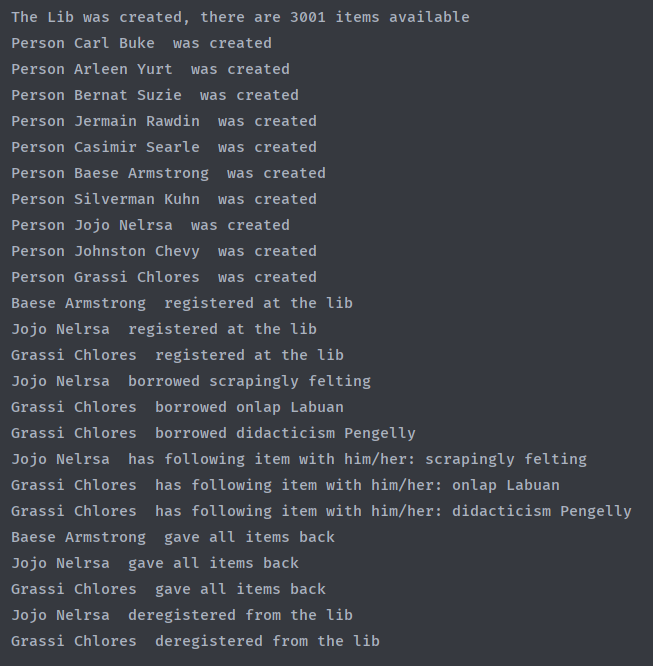

## University Assignment "Library"

The assignment was to build a library programm. Customers should be able to register, borrow,
give back, and deregister

## Features

-Fully scalable 

-Complete record of all transactions

-Namegenerator to generate Authors and Booknames

-Fast record search via std::map

## Structure

 
## Output

